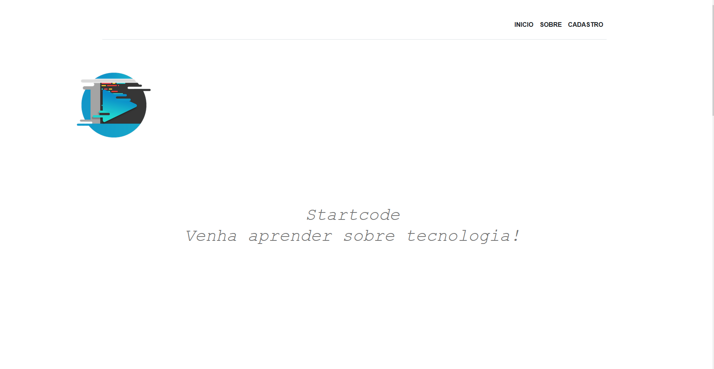
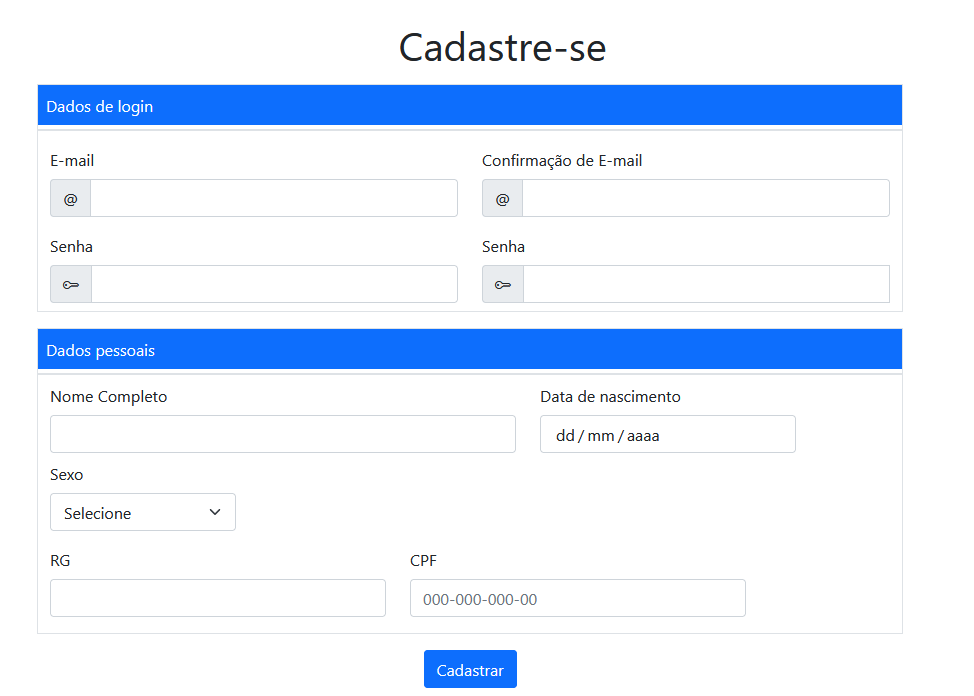
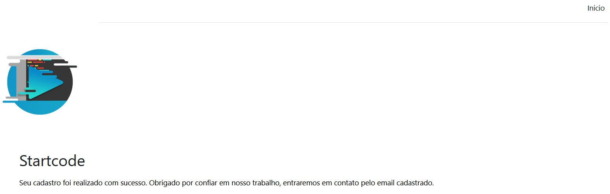

# Startcode
Startcode uma empresa fictícia que ensina sobre programação. Utilizei HTML, CSS, BOOTSTRAP, e "Js" para desenvolvê-la. 
Bootstrap usei para desenvolver o cadastro do aluno como também, a navegação entre as paginas.
O Js foi apenas para dar um alert ao clicar em cadastrar, por isso usei "" para me fererir à ele.

### _Uma breve demonstração sobre o site desenvolvido_

 

 
  Primeira tela após entrar no site

 
   

 
 

 
  Tela de cadastro feita com bootstrap 

 
   

 

 

 
  Um exemplo após a finalização do cadastro.

 
   

 
